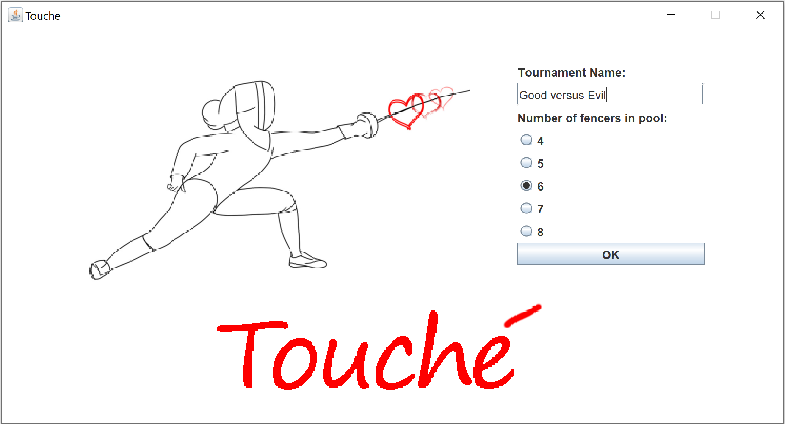
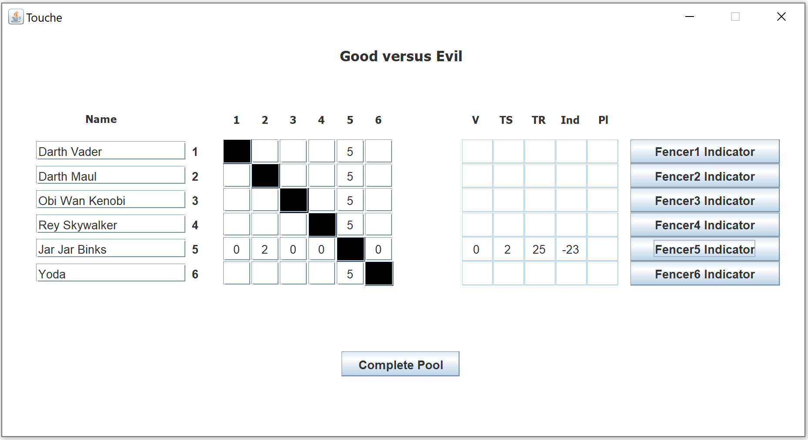
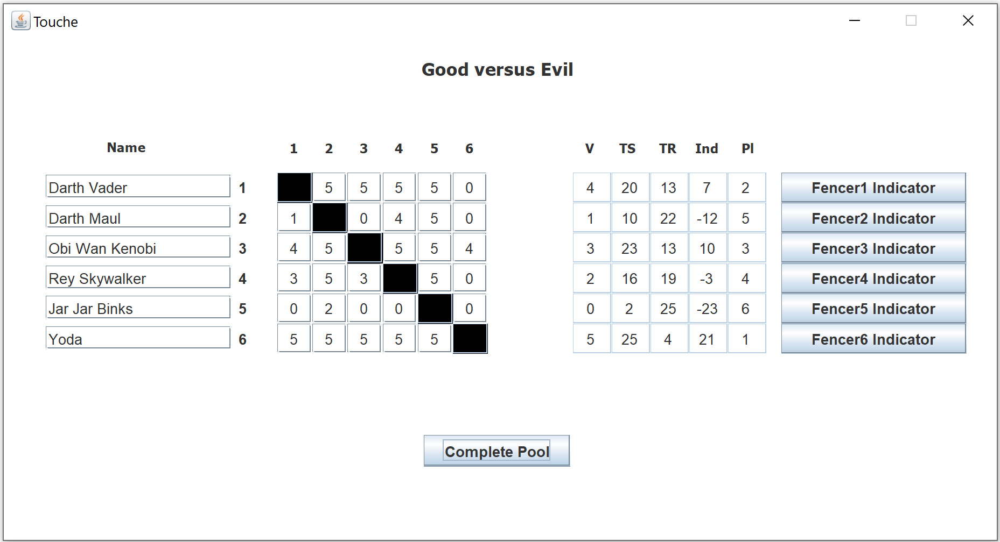

# Touché

* Typically, fencers do not record their scores during pools and rely on memory (which can be faulty) to keep track of their bouts. At the end of the pool when the referee requires fencers to sign the scoresheet, there are occasional disagreements on the scores due to faulty memory on the fencer’s part, or incorrect score entry from the referee.

* The Touché application will allow fencers to track their scores on the strip, and optionally other fencer’s scores with an interface that resembles an official scoresheet. The typical way to use the app will be for the fencer to fill out their own bout scores, completing only their row and column.  Once the row (touches scored) and the column (touches received) are complete, the fencer’s victories, total touches scored, total touches received, and indicator will be calculated by pressing a “calculate indicator” button.

*	If the fencer desires, they can also fill out the entire scoresheet.  In this case the victories, total touches scored, total touches received, indicator, and place will be calculated.

